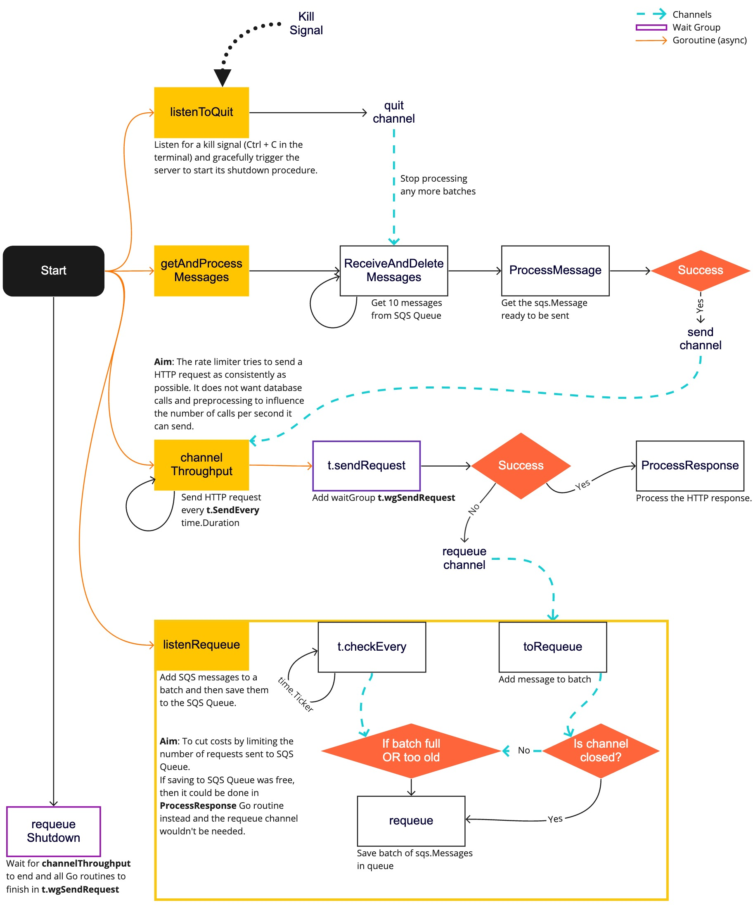

# `ratelimiter`     _:prototype:_

## **MISSION:**
To send rate limited HTTP requests as consistently as possible.

This implementation performs pre-processing and cleanup for each request in separate go routines, limiting
interference of any long-running processes, network timeouts or slow database queries.

### TODO
- Some HTTP errors can be handled gracefully and can be requested straight away, but JSON unmarshalling errors need to be re-queued.
- Provide an easy way to set up multiple rate limiters with different endpoints and settings.
- Can we provide or override the functions/methods called in the rate limiter? Perhaps an interface would be a good fit - a struct that implements set methods?

### Done
- Add another channel for requeuing our SQS messages. We batch updates to limit costs.

## Diagram
Modify this flowchart diagram with [Miro](https://miro.com/app/board/uXjVObhdR_w=/?invite_link_id=827663665880) on the Assembly Payments Platform team.
